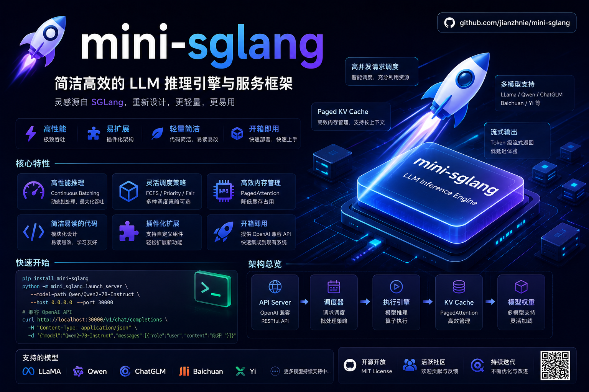

# Mini-SGLang

<p align="center">
  
</p>

<p align="center">
  <a href="README.md">English</a> | 中文
</p>

**Mini-SGLang** 是 [SGLang](https://github.com/sgl-project/sglang) 的轻量级教学实现，用 ~4,800 行 Python 完整复刻了一个高性能 LLM 推理框架的核心机制。项目拆解了现代 LLM 服务系统的每一个关键环节，让开发者能够逐行理解推理引擎的内部工作原理。

## 核心特性

- **Continuous Batching** — Prefill / Decode 两阶段分离调度，最大化吞吐
- **PagedAttention** — 页式 KV Cache 管理，消除显存碎片
- **RadixCache** — 基于 Radix Tree 的前缀感知缓存，自动复用公共前缀
- **CUDA / NPU Graph** — Decode 阶段 kernel launch overhead 优化（支持 NVIDIA CUDA 和华为 Ascend NPU）
- **Tensor Parallelism** — Column / Row Parallel Linear 层逻辑已就绪；多进程 TP 启动尚未实现（`--tp-size > 1` 会直接报错退出）
- **多设备支持** — NVIDIA CUDA / 华为 Ascend NPU / CPU，自动检测优先级
- **可插拔 Attention 后端** — FlashAttention (`fa`，不可用时自动回退 PyTorch SDPA) / PyTorch SDPA (`pt`)
- **OpenAI 兼容 API** — `/v1/chat/completions` + `/v1/completions` + SSE 流式返回

## 架构概览

```
Client (HTTP/SSE)
    │
    ▼
Frontend (FastAPI) ── Tokenizer (HF tokenizer)
    │
    ▼
Scheduler ── PrefillManager + DecodeManager
    │
    ▼
Engine (Model Forward + Sampling)
    │
    ▼
KV Cache Pool + RadixCache + CUDA/NPU Graphs
```

### 请求生命周期

1. **接入**: FastAPI 接收请求 → Tokenizer encode → Scheduler 入队
2. **Prefill**: 分配 KV Cache pages → 全量 prompt tokens 并行 forward → 生成首个 output token
3. **Decode**: 逐 token 生成 → CUDA Graph 回放加速 → Sampler 采样 → 追加到 input_ids
4. **返回**: Scheduler → Detokenize → Frontend → SSE 流式返回客户端
5. **终止**: 遇到 EOS 或达到 `max_tokens` 或客户端断开

## 快速开始

### 安装

```bash
pip install -e .
# 或手动安装依赖
pip install torch transformers fastapi uvicorn safetensors
# 可选：高性能 attention 后端
pip install flash-attn
```

### 启动服务

```bash
# 单 GPU (CUDA)
python -m minisgl --model-path Qwen/Qwen3-0.6B --port 8000

# 华为 Ascend NPU
python -m minisgl --model-path Qwen/Qwen3-0.6B --device npu --attention-backend pt

# 交互式 Shell
python -m minisgl --model-path Qwen/Qwen3-0.6B --shell
```

> 注：`--tp-size > 1` 暂不支持——多进程 TP 启动尚未实现（TP 层的 Column/Row
> Parallel 逻辑已就绪），传入会直接报错退出。

### 命令行参数

| 参数 | 默认值 | 说明 |
|------|--------|------|
| `--model-path` | (必填) | HuggingFace 模型路径 |
| `--host` | `127.0.0.1` | API 监听地址 |
| `--port` | `8000` | API 端口 |
| `--tp-size` | `1` | Tensor Parallelism 卡数；`>1` 会报错退出（多进程 TP 启动未实现） |
| `--device` | `auto` | 设备类型：`auto` / `cuda` / `npu` / `cpu` |
| `--memory-ratio` | `0.9` | KV Cache 可用显存比例 |
| `--max-running-req` | `256` | 最大并发请求数 |
| `--max-seq-len` | `8192` | 最大序列长度 |
| `--page-size` | `16` | KV Cache 页大小（tokens） |
| `--cuda-graph-bs` | `None` | Graph 捕获的最大 batch size（CUDA/NPU） |
| `--attention-backend` | `fa` | 注意力后端：`fa`（FlashAttention，不可用回退 PyTorch SDPA）/ `pt`（PyTorch SDPA） |
| `--dtype` | `auto` | 模型精度：`auto`（读 config.json）/ `float16` / `bfloat16` / `float32`（CPU 强制 float32） |
| `--trust-remote-code` | `False` | 信任 HF 模型的自定义代码 |
| `--log-level` | `INFO` | 日志级别：`DEBUG` / `INFO` / `WARNING` / `ERROR` |
| `--shell` | `False` | 交互式 CLI 模式 |

### Python API

```python
from minisgl.engine.llm import LLM

llm = LLM(model_path="Qwen/Qwen3-0.6B")

# 单条生成
output = llm.generate("Hello, who are you?", max_tokens=128)

# 批量生成
outputs = llm.generate(["Hello", "What is AI?"], temperature=0.7)

# Chat 接口
messages = [{"role": "user", "content": "What is 2+2?"}]
response = llm.chat(messages, max_tokens=128)
```

### API 端点

```bash
# Chat Completions
curl http://127.0.0.1:8000/v1/chat/completions \
  -H "Content-Type: application/json" \
  -d '{"messages":[{"role":"user","content":"Hello"}],"stream":true}'

# Text Completions
curl http://127.0.0.1:8000/v1/completions \
  -H "Content-Type: application/json" \
  -d '{"prompt":"Once upon a time","max_tokens":30,"stream":false}'

# Health Check
curl http://127.0.0.1:8000/health
```

## 示例

```
examples/
├── _common.py           # 共享工具：模型发现、引擎搭建、生成循环
├── cpu_demo.py          # 零依赖 CPU 自包含 demo（无需下载模型）
├── offline_inference.py # 综合离线推理：批量生成、LLM API、流式、采样策略
├── benchmark.py         # 性能基准：prefill 延迟、decode 吞吐、端到端
├── server_demo.py       # OpenAI 兼容 API 服务 + 自动化测试
└── npu_inference.py     # 华为 Ascend NPU 推理 + 多模型测试
```

### CPU 自包含 Demo（无需下载模型）

```bash
python examples/cpu_demo.py
```

创建一个临时的随机权重小模型，验证完整的 Engine → Scheduler → Generate 管线。

### 综合离线推理

```bash
python examples/offline_inference.py --model-path /path/to/model
```

涵盖：Engine+Scheduler 批量推理、LLM.generate()/chat() 高级 API、流式逐 token 生成（含 TTFT/吞吐指标）、采样策略对比（greedy/temperature/top-p/top-k）。

### 性能基准测试

```bash
python examples/benchmark.py --model-path /path/to/model
```

### OpenAI 兼容 API 服务

```bash
python examples/server_demo.py --model-path /path/to/model
```

启动 FastAPI 服务器，自动测试 health check / sync completion / SSE streaming / chat。

### NPU 推理

```bash
python examples/npu_inference.py --model-path /path/to/model --device npu
python examples/npu_inference.py --models Qwen3-0.6B Qwen3-1.7B Qwen3-4B
```

## 华为 Ascend NPU 支持

Mini-SGLang 完整支持华为昇腾 NPU 推理，通过 `torch_npu` 实现设备无关的张量计算。

### 环境要求

- CANN 9.0.0+
- PyTorch 2.5+ 与匹配的 torch_npu 版本
- 推荐使用 Docker 镜像：`torchtitan-npu:cann9.0.0-torch2.12.0`

### NPU 快速启动

```bash
# 使用 Docker（推荐）
docker run --privileged --shm-size=16g \
  -e ASCEND_RT_VISIBLE_DEVICES=0 \
  -v /usr/local/Ascend/driver:/usr/local/Ascend/driver \
  -v /path/to/models:/models \
  torchtitan-npu:cann9.0.0-torch2.12.0 \
  python -m minisgl --model-path /models/Qwen3-0.6B --device npu --attention-backend pt

# NPU 单模型推理
python examples/npu_inference.py --model-path /path/to/Qwen3-0.6B --device npu

# NPU 多模型批量测试
python examples/npu_inference.py --models Qwen3-0.6B Qwen3-1.7B Qwen3-4B
```

### NPU 适配要点

| 项目 | 适配方案 |
|------|---------|
| 设备检测 | `torch.npu.is_available()` 自动检测，优先级 NPU > CUDA > CPU |
| Attention | 使用 PyTorch SDPA（`--attention-backend pt`），torch_npu 提供硬件加速 |
| Graph 加速 | `torch.npu.NPUGraph()` 替代 CUDA Graph（需 `TASK_QUEUE_ENABLE=1`） |
| 分布式通信 | HCCL 后端自动选择（替代 NCCL） |
| 内存管理 | `torch.npu.mem_get_info()` 统一显存查询 |
| 索引操作 | 所有高级索引使用 `int64`（NPU 要求） |

### NPU 性能测试结果

**测试环境**: `torchtitan-npu:cann9.0.0-torch2.12.0` | Ascend 910 (64GB HBM) | torch 2.12.0 + torch_npu 2.12.0rc1

| 模型 | 状态 | 加载时间 | Prefill | Decode | 批量(3x)吞吐 |
|------|------|---------|---------|--------|-------------|
| **Qwen3-0.6B** | PASS | 13.0s | 57.4 tok/s | 14.3 tok/s | 54.0 tok/s |
| **Qwen3-1.7B** | PASS | 13.0s | 201.4 tok/s | 13.5 tok/s | 36.0 tok/s |
| **Qwen3-4B** | PASS | 24.4s | 260.9 tok/s | 13.0 tok/s | 39.2 tok/s |

> 3/3 模型全部通过，生成结果语义正确。Eager 模式推理稳定可靠。
>
> 测试命令：`python examples/npu_inference.py --models Qwen3-0.6B Qwen3-1.7B Qwen3-4B --max-tokens 30`

## 支持的模型

Mini-SGLang 支持 **Qwen3 系列**的稠密 decoder-only 模型。

| 模型 | 架构要点 | CUDA 验证 | NPU 验证 |
|------|---------|-----------|----------|
| **Qwen3** | RMSNorm + RoPE + SwiGLU + QK LayerNorm + GQA | Qwen3-0.6B | Qwen3-{0.6B, 1.7B, 4B} |
| **Qwen3-MoE** | Qwen3 + 稀疏 MoE Router（softmax → top-k → 归一，对齐 HF） | (单元测试) | (单元测试) |

## 运行测试

```bash
# 单元测试（99 个测试，CPU 即可，~15s）——目录镜像 minisgl 包结构
python -m pytest tests
# 或直接运行单个文件：
python tests/scheduler/test_scheduler.py

# 示例冒烟测试（cpu_demo 无需模型；模型用例通过 MINISGL_TEST_MODELS 传入本地模型路径，未设置则跳过）
python tests/test_examples.py

# NPU 环境测试（需要 Docker + Ascend 硬件）
docker run --privileged -v /usr/local/Ascend/driver:/usr/local/Ascend/driver \
  -v $(pwd):/workspace -w /workspace torchtitan-npu:cann9.0.0-torch2.12.0 \
  python -m pytest tests
```

测试文件镜像 `minisgl/` 的子包：`tests/models/`、`tests/engine/`、`tests/scheduler/`、`tests/server/`、`tests/utils/`。

### 测试覆盖

- **模型层**: RMSNorm, RoPE, Linear, Embedding, Attention Backend, 各模型 forward pass
- **缓存**: KVCachePool alloc/free, RadixCache prefix/evict/remove, NaiveCacheManager
- **调度**: PrefillManager, DecodeManager, BatchContext, Req 生命周期
- **采样**: Greedy, Top-K, Top-P, Temperature, 边界情况
- **设备**: NPU 检测, 设备切换, 内存查询, 分布式后端选择
- **集成**: 端到端调度循环, 多请求并发, EOS 终止, OpenAI API 端点, SSE 流式
- **前端**: FrontendManager 请求提交/获取/清理

## 参考项目

- [SGLang](https://github.com/sgl-project/sglang) — 架构蓝本
- [vLLM](https://github.com/vllm-project/vllm) — PagedAttention 参考
- [FlashAttention](https://github.com/Dao-AILab/flash-attention) — Attention kernel
- [torch_npu](https://gitee.com/ascend/pytorch) — 华为 Ascend NPU PyTorch 后端
